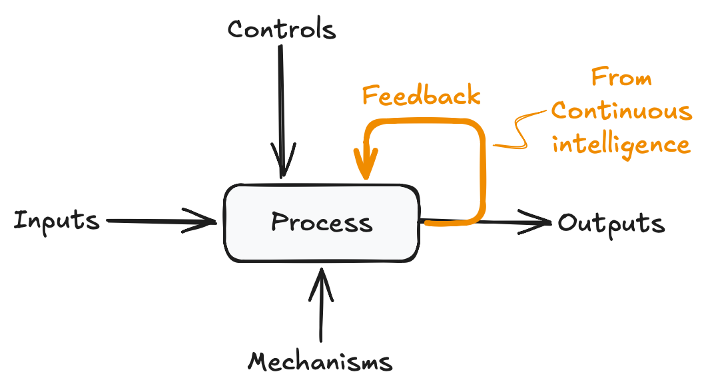

# Continuous Intelligence

## What & Why

**Continuous intelligence** is a practice in which data streams are analyzed as they are produced, giving a real-time (or near real-time) view of any process or system that produces data in an on-going fashion.

Continuous intelligence gives you the opportunity to see behavior of a system before it's "finished"; potentially giving you the opportunity to preempt degradation before the processes in runs have completed.

## When

In some ways I've been doing continuous intelligence work since 13 years ago when I started my Data Journal. It's a day-by-day combination habit tracker and personal journal. I derived signals from it in real-time to and adjust my behavior to align more with my goals. If life were a system, this project would be about adding continuous intelligence to it.

This site is associated with my work in CSIS 44630 Continuous Intelligence while obtaining my Master's in Data Analytics. For the past 6 weeks I've taken a more formal look at continuous intelligence, practicing several techniques for implementing it.

## How

The best example of the work done in this class, is the [Data Journal Project](https://github.com/aarongilly/cintel-06-continuous-intelligence/blob/main/src/cintel/continuous_intelligence_data_journal.py) attached to [this GitHub repo](https://github.com/aarongilly/cintel-06-continuous-intelligence) (which also contains the documentation you're reading now). It incorporates *most* of the techniques we learned.

1. Effective project structuring
2. Reading system data into a DataFrame
3. Defining explicit thresholds
4. Creating signals (i.e. feature engineering)
5. Performing anomally detection
6. Creating output artifacts which detail system performance

This covers a broad swath of the materials covered in this class - excepting the use of "known good" performance metrics as a baseline. We built a pipeline for **drift detection** using a comparison-against-baseline approach was used in a previous week in [this GitHub Repo from Week 5](https://github.com/aarongilly/cintel-05-drift-detection/blob/main/src/cintel/data_journal_drift_detector.py). The use case there *also* utilized my Data Journal dataset.

Lastly, the use of a rolling window is common in practice but not covered in this particular project. An example utilizing a rolling window is in [this GitHub Repo from Week 4](https://github.com/aarongilly/cintel-04-rolling-monitoring/blob/main/src/cintel/rolling_monitor_gillespie.py). The use case there was, very surprisingly, my Data Journal dataset.

I like using my own data. If you're learning data stuff *(or even if you're not)*, **it's a really good thing to have**. [You should make one for yourself!](https://datajournal.guide)

---

Which reminds me - check out [my general portfolio](./general-portfolio.md)!
