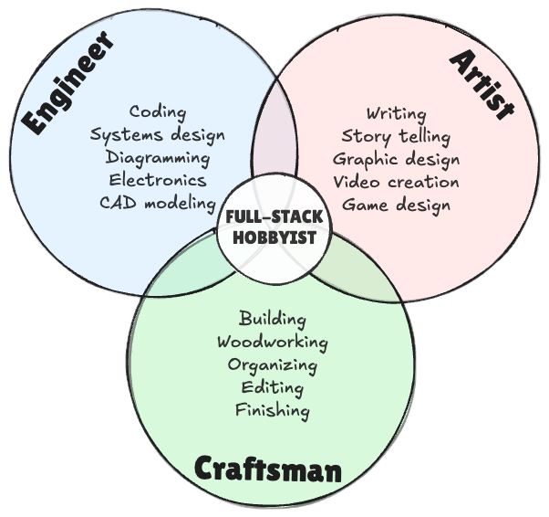
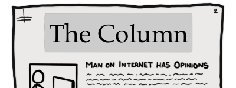
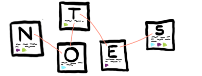
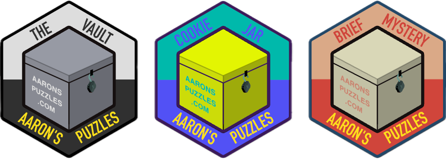

# My Work – Outside Continuous Intelligence

I'm Aaron Gillespie. I aim to be a **full stack hobbyist**.

This means I like to make things. These are some of the more long-running things I've made.

## The Column

Since **2012** I've maintained [aarongilly.com](https://aarongilly.com), a blog about whatever I feel like writing about at the time. Lots of consumer tech stuff and general life things.

## Data Journal

Since **2014** I've maintained a Data Journal, which is essentially just a glorified spreadsheet + some other stuff built around it. More recently I made [datajournal.guide](https://datajournal.guide), a site that explains how and why to build a Data Journal.

## Gillespedia

Since **2020** I've maintained [Gillespedia.com](https://gillespedia.com), a public cache of evergreen notes. Think of it like a one-man very bad version of Wikipedia.

## Aaron's Puzzles

Since **2021** I've maintained [aaronspuzzles.com](https://aaronspuzzles.com), a half-physical, half-digital reverse escape room in a box. Each year I produce a new puzzle. In 2024, I made the [Brief Mystery – a free puzzle game you can do entirely in your browser](https://aaronspuzzles.com/BriefMystery/).

## Second-a-Day

From **2013** to **2020** I did a second-a-day video project.

<iframe width="560" height="315" src="https://www.youtube.com/embed/videoseries?si=RImyYxL1rio3PDyY&amp;list=PLmlnPk8L9dSJM8HcSDsRFcjrVAGOUfPuw" title="YouTube video player" frameborder="0" allow="accelerometer; autoplay; clipboard-write; encrypted-media; gyroscope; picture-in-picture; web-share" referrerpolicy="strict-origin-when-cross-origin" allowfullscreen></iframe>

This is a project I'd deeply like to pick back up on.

## Other Stuff

There's other stuff.

- I made two plugins for Obsidian
  - [Semantic Canvas](obsidian://show-plugin?id=semantic-canvas)
  - [Auto-properties](https://github.com/aarongilly/obsidian-auto-properties) *(still pending approval to the Obsidian Community Plug-ins list)*
- I build things with my hands.
- I do some drawing from time to time.
- I make a somewhat ridiculous number of diagrams for very little reason.
- I dabble in smart home and self-hosting spaces.
- I have honed in on a very good & well-rounded fitness routine, supported by quarterly [self-designed fitness tests](https://docs.google.com/spreadsheets/d/1qGPCBW3gkAhG-EBtMYYoKXv-UFdBiZLV3GaBszXwGwA/edit?gid=0#gid=0).
- I tried to improve my [meal prep](https://docs.google.com/spreadsheets/d/1RoKmY_-aQk5KvdJWrV7-mwyRyUmCsIX6SQFpBoSdNA0/edit?usp=sharing).

Mostly, though, I think and I write.
